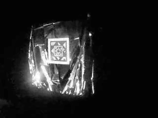
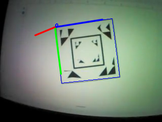

##  Recursive Fiducial Marker
### In-Space Rendezvous, Proximity Operations and Docking System

This repository contains the implementation of proposed fiducial marker. The marker template is derived from square spidron. The encoding is inside the marker is based on mesh triangles generated using Delaunay triangulation.  

The marker pose is computed using OpenCV's implementation of PnP solver. The fiducial marker uses superimposition of mesh for computing the binary descriptor. 

### Reference

A Study on Texture Characterization of Fiducial Markers for Visual Navigation. Texas A&M University, 2024
